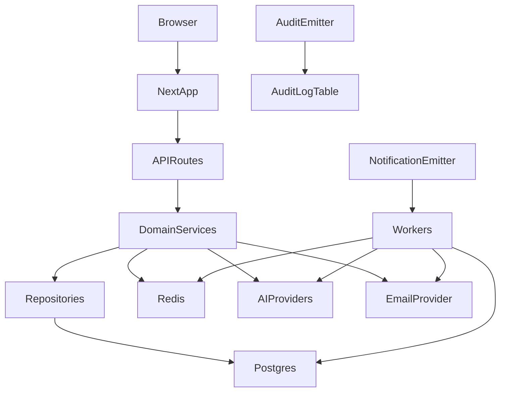
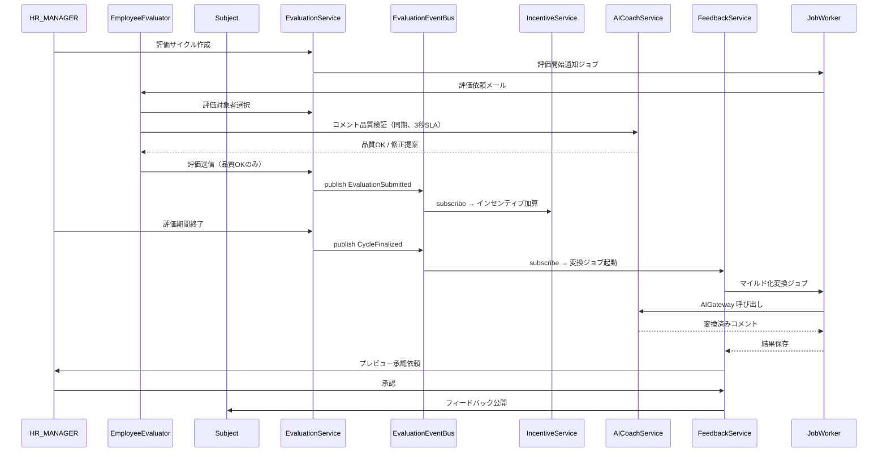
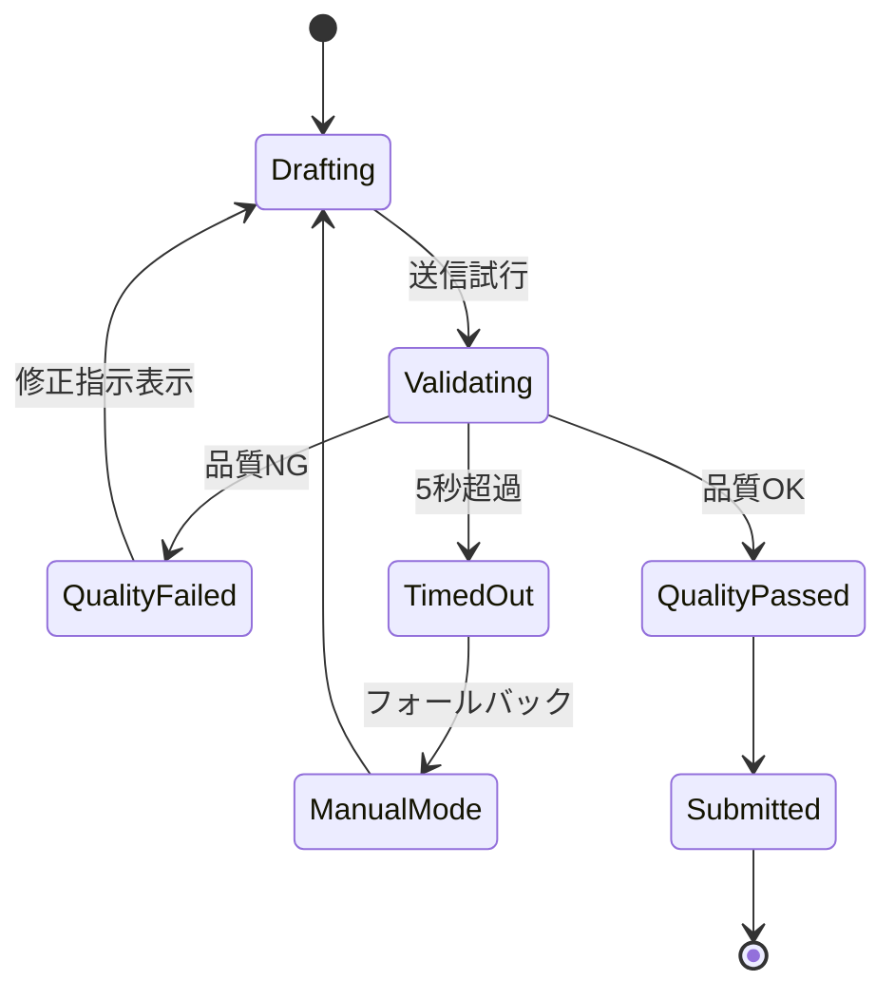
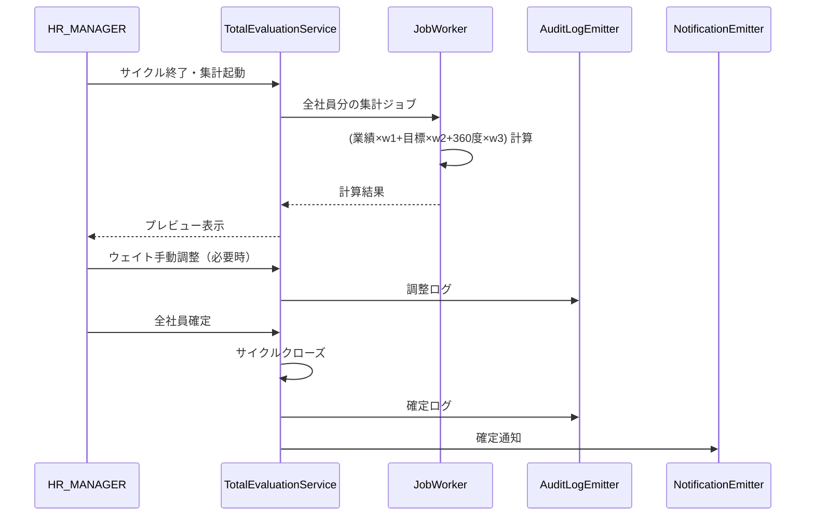
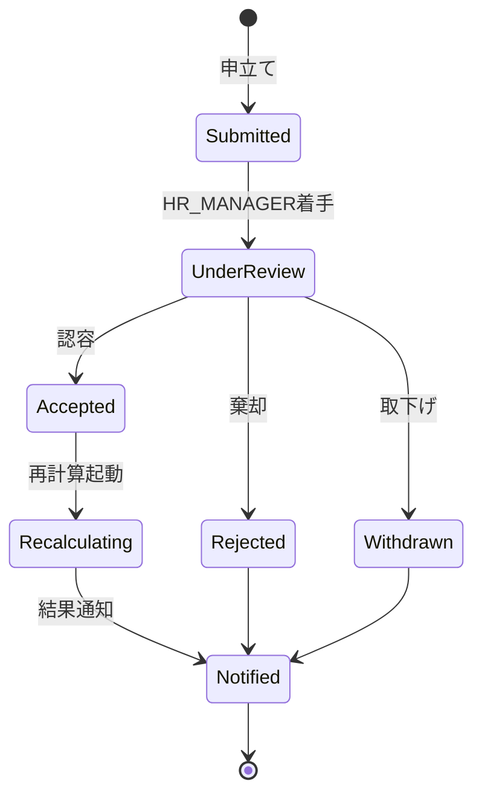
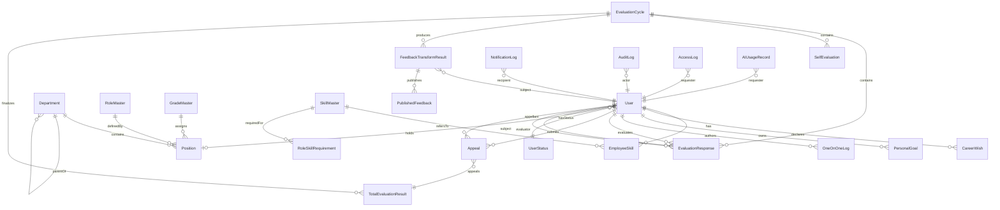

# Technical Design Document

## Overview

**Purpose**: HRプラットフォームは、組織体制・人材配置・人事評価を一元管理し、AIを活用した360度評価で社員の成長と組織目標達成を支援する価値を、HR_MANAGER / MANAGER / EMPLOYEE / ADMIN に提供する。

**Users**: ADMIN（マスタ・監査・AIコスト管理）、HR_MANAGER（評価サイクル・総合評価確定）、MANAGER（目標承認・1on1・評価）、EMPLOYEE（自己評価・ピア評価・FB受領・異議申立て）が、期初〜期末の人事サイクル全体で利用する。

**Impact**: 新規プロジェクトのため既存システムへの影響はない。将来的にSSO/IdPとの連携時に認証層が変更対象。

### Goals
- 20要件・152受け入れ基準を満たす機能完全性
- 評価者匿名性とデータ保護の物理的担保
- AI呼び出しのコストと品質の統制
- Phase 1（MVP）→ Phase 2（拡張）の段階的リリース可能な設計

### Non-Goals
- マイクロサービス化（初期フェーズでは過剰）
- 独自 AI モデルの構築・運用（外部APIのみ使用）

### Phase 2 対応範囲（Phase 1 Non-Goals）

| 機能 | 要件ID | コンポーネント | データモデル |
|------|--------|---------------|-------------|
| 2FA（TOTP） | 1.16 | AuthTwoFactorService | TwoFactorSecret |
| SSO（SAML/OIDC） | 1.17 | AuthSSOService | - |
| 3Dネットワーク図 | 4.9 | SkillAnalytics3D | - |
| 多言語・多TZ | 20.15 | User.locale/timezone 拡張 | User（フィールド準備済） |

Phase 2 機能は Phase 1 インターフェースには含まれず、Phase 2 実装時に追加する。データモデルは一部 Phase 1 でフィールド予約済み（User.locale/timezone）。

---

## Architecture

### Architecture Pattern & Boundary Map

選択パターン: **モジュラモノリス**（Next.js App Router + 19 ドメインモジュール）



- **選択パターン**: モジュラモノリス（根拠は research.md 参照）
- **ドメイン境界**: 19ドメイン × レイヤー分離（Presentation / Service / Repository / Job）
- **既存パターン保持**: なし（新規プロジェクト）
- **新コンポーネントの根拠**: 要件ドメインに1:1対応。横断ドメイン（notification/audit-log/search/ai-monitoring）は Pub/Sub モデル
- **ステアリング準拠**: structure.md の依存方向規約・AI呼び出し集約ルール・監査ログ発行パスを遵守

### Technology Stack

| Layer | Choice / Version | Role in Feature | Notes |
|-------|------------------|-----------------|-------|
| Frontend | Next.js 15 / React 19 / TypeScript 5 | UI・RSC・Server Components | App Router 使用 |
| UI | shadcn/ui + Tailwind CSS 4 | デザインシステム | コンポーネント自己所有 |
| Backend | Next.js Route Handlers | REST API 提供 | `/api/v1/**` |
| Auth | NextAuth.js v5 | セッション・ロール判定 | Credentials Provider |
| Data | PostgreSQL 16 + Prisma 6 | 永続ストレージ・型安全DB操作 | AES-256 暗号化 |
| Cache | Redis 7 | セッション・レート制限・AIキャッシュ | BullMQ と共用 |
| Jobs | BullMQ | 非同期ジョブ（AI・通知・集計） | Bull Board で監視 |
| AI | Anthropic Claude SDK（主）/ OpenAI SDK（フォールバック） | 対話型品質ゲート・マイルド化・要約 | `AI_PROVIDER` 環境変数で切替 |
| Email | Resend + React Email | 通知メール送信 | テンプレートを型安全に管理 |
| Search | PostgreSQL FTS（初期）/ Meilisearch（拡張） | 社員検索 | 段階的に移行 |
| Charts | Recharts（2D）/ react-three-fiber（3D, Phase 2） | データ可視化 | レーダー・ヒートマップ・折れ線 |
| Testing | Vitest + Playwright | ユニット・統合・E2E | カバレッジ 80%+ |

---

## System Flows

### Flow 1: 360度評価のライフサイクル



### Flow 2: AIコーチング品質ゲート



### Flow 3: 総合評価の計算・確定



### Flow 4: 異議申立てプロセス



---

## Requirements Traceability

| Req | Summary | Components | Interfaces | Flows |
|-----|---------|------------|------------|-------|
| 1 | 認証・認可・セッション管理 | AuthService, UserRepo | login, logout, listActiveSessions, revokeSession, changePassword | — |
| 2 | マスタ管理 | MasterService, MasterRepo | upsertSkill, upsertRole, upsertGrade, importCsv | — |
| 3 | 組織体制管理 | OrganizationService, OrgRepo | updateHierarchy, detectCycle, recordTransfer | — |
| 4 | スキルマップ | SkillService, SkillRepo, SkillAnalytics | registerSkill, approveSkill, computeGap, listPostCandidates | — |
| 5 | キャリア管理 | CareerService, CareerRepo | setCareerWish, listGap | — |
| 6 | 目標管理 | GoalService, GoalRepo, GoalApprovalService | createGoal, approveGoal, updateProgress | — |
| 7 | 1on1ログ管理 | OneOnOneService, OneOnOneRepo | scheduleSession, recordLog, listTimeline | — |
| 8 | 360度評価 | EvaluationService, CycleService, EvaluationRepo | createCycle, selectTargets, submitResponse, declineTarget, assignSubstitute, computeScores, getCycleProgress, getEvaluatorProgress | Flow 1 |
| 9 | AIコーチング | AICoachService, AIGateway | validateComment | Flow 2 |
| 10 | フィードバック変換 | FeedbackService, FeedbackTransformJob | scheduleTransform, previewBeforePublish, publish | Flow 1 |
| 11 | 評価者インセンティブ | IncentiveService | applyIncentive, getCumulativeScore | — |
| 12 | 総合評価 | TotalEvaluationService, TotalEvalCalcJob | calculate, overrideWeight, finalize | Flow 3 |
| 13 | ダッシュボード | DashboardService, DashboardRepo | getKpiSummary, exportReport | — |
| 14 | 社員ライフサイクル | LifecycleService, ProfileService | bulkImportUsers, updateStatus, editProfile | — |
| 15 | 通知基盤 | NotificationEmitter, NotificationService, EmailWorker | emit, updatePreferences, markRead | — |
| 16 | 社員検索 | SearchService, SearchIndexer | queryEmployees | — |
| 17 | 監査ログ・アクセスログ | AuditLogEmitter, AuditLogReader, AccessLogMiddleware, AccessLogReader | emit, query, export（非同期）, record | — |
| 18 | 異議申立て | AppealService | submitAppeal, reviewAppeal, finalizeAppeal | Flow 4 |
| 19 | AIコスト監視 | AIMonitoringService, AIUsageRepo | recordUsage, getMonthlyCost, detectAnomaly | — |
| 20 | 非機能要件 | 全コンポーネント横断 | — | — |

---

## Components and Interfaces

### Component Summary

Phase 表記: **P1** = Phase 1（MVP）、**P2** = Phase 2 拡張。要件IDに Phase を併記。

| Component | Domain | Intent | Req | Key Dependencies | Contracts |
|-----------|--------|--------|-----|------------------|-----------|
| AuthService | auth | 認証・セッション | 1.1-1.15 (P1) | UserRepo, Redis | Service, API |
| AuthService.twoFactor | auth | TOTP/SSO | 1.16, 1.17 (P2) | TwoFactorSecret, IdP | Service, API |
| MasterService | master | マスタCRUD | 2 | MasterRepo | Service, API |
| OrganizationService | organization | 組織図・異動履歴 | 3 | OrgRepo, AuditLogEmitter | Service, API |
| SkillService | skill | スキル登録・承認 | 4.4, 4.5 (P1) | SkillRepo | Service, API |
| SkillAnalytics | skill | 2Dヒートマップ/レーダー/ギャップ | 4.1-4.3, 4.6-4.8 (P1) | SkillRepo, SkillGapCalculator | Service |
| SkillAnalytics3D | skill | 3Dネットワーク図 | 4.9 (P2) | SkillRepo | Service |
| CareerService | career | キャリア希望管理 | 5 | CareerRepo, shared/SkillGapCalculator | Service, API |
| GoalService | goal | 目標管理・承認フロー | 6 | GoalRepo, NotificationEmitter | Service, API, State |
| OneOnOneService | one-on-one | 1on1ログ・予定 | 7 | OneOnOneRepo | Service, API |
| EvaluationService | evaluation | 360度評価運用 | 8 | CycleService, EvaluationEventBus | Service, API, State, Event |
| CycleService | evaluation | 評価サイクル状態管理 | 8 | EvaluationRepo | Service, State |
| AICoachService | ai-coach | 品質ゲート | 9 | AIGateway, AIMonitoringService | Service, API |
| AIGateway | ai-coach | AI Provider抽象化 | 9,10,19 | Claude/OpenAI SDK | Service |
| FeedbackService | feedback | 変換・公開 | 10 | AIGateway, FeedbackTransformJob | Service, API, Batch |
| IncentiveService | incentive | インセンティブ加算 | 11 | IncentiveRepo | Service |
| TotalEvaluationService | total-evaluation | 加重平均計算・確定 | 12 | TotalEvalCalcJob, AuditLogEmitter | Service, API, State |
| DashboardService | dashboard | KPI・レポート | 13 | 各ドメインRepo | Service, API |
| LifecycleService | lifecycle | 入退社・ステータス | 14 | UserRepo, NotificationEmitter | Service, API |
| ProfileService | lifecycle | プロフィール管理 | 14 | UserRepo | Service, API |
| NotificationEmitter | notification | 通知発行 | 15,横断 | NotificationService | Event |
| NotificationService | notification | 配信制御・設定 | 15 | EmailWorker, NotificationRepo | Service, API |
| EmailWorker | notification | メール送信（Job） | 15 | Resend | Batch |
| SearchService | search | 社員検索 | 16 | PgFTS | Service, API |
| AuditLogEmitter | audit-log | 監査ログ発行 | 17,横断 | AuditLogRepo | Event |
| AuditLogReader | audit-log | ログ閲覧・エクスポート | 17 | AuditLogRepo | Service, API |
| AccessLogMiddleware | audit-log | HTTPアクセスログ記録（横断） | 17.6 | AccessLogRepo | Middleware |
| AccessLogReader | audit-log | アクセスログ閲覧 | 17.6 | AccessLogRepo | Service, API |
| SkillGapCalculator | shared | スキル要件と保有スキルの差分計算（career/skill 共有） | 4,5 | SkillRepo, RoleMasterRepo | Service |
| EvaluationEventBus | shared | 評価ドメインのイベント発行/購読 | 8,10,11 | Redis Pub/Sub | Event |
| ExportJob | shared | CSV/PDFエクスポート非同期ジョブ | 2,3,13,17 | BullMQ, Blob Storage | Batch |
| AppealService | appeal | 異議申立て・審査 | 18 | TotalEvaluationService, NotificationEmitter | Service, API, State |
| AIMonitoringService | ai-monitoring | 使用量・コスト監視 | 19 | AIUsageRepo | Service, API |

### auth ドメイン

#### AuthService

| Field | Detail |
|-------|--------|
| Intent | 認証・セッション発行・ロール判定を集約 |
| Requirements | 1.1, 1.2, 1.3, 1.4, 1.5, 1.6, 1.10, 1.11, 1.12, 1.13, 1.14, 1.15 |

**Responsibilities & Constraints**
- パスワード検証、セッション発行、レート制限
- 5回連続失敗でアカウントロック（15分）
- パスワード複雑度・過去5世代チェック
- bcrypt cost 12+
- セッション8時間・アイドル30分失効

**Dependencies**
- Outbound: UserRepo（必須）, Redis セッションストア（必須）, NotificationEmitter（ロック通知）
- External: NextAuth.js v5

**Contracts**: Service / API

**Phase 1 契約**:
```typescript
interface AuthService {
  login(input: LoginInput): Promise<Result<Session, DomainError>>;
  logout(sessionId: string): Promise<void>;
  listActiveSessions(userId: UserId): Promise<Session[]>;
  revokeSession(userId: UserId, sessionId: string): Promise<void>;
  changePassword(userId: UserId, input: ChangePasswordInput): Promise<Result<void, DomainError>>;
}
```

**Phase 2 拡張契約**:
```typescript
interface AuthTwoFactorService {  // Phase 2
  enableTotp(userId: UserId): Promise<{ secret: string; qrCodeUrl: string }>;
  verifyTotp(userId: UserId, code: string): Promise<Result<void, DomainError>>;
  disableTotp(userId: UserId): Promise<void>;
}

interface AuthSSOService {  // Phase 2
  initiateSAMLLogin(returnTo: string): Promise<{ redirectUrl: string }>;
  completeSAMLCallback(assertion: string): Promise<Result<Session, DomainError>>;
  initiateOIDCLogin(returnTo: string): Promise<{ redirectUrl: string }>;
  completeOIDCCallback(code: string, state: string): Promise<Result<Session, DomainError>>;
}
```
- Preconditions: ユーザー存在・パスワードがポリシーに準拠
- Postconditions: セッショントークンが有効 or ロック状態確定
- Invariants: 失敗回数はRedisで管理・時間経過でリセット

### master ドメイン

#### MasterService

| Field | Detail |
|-------|--------|
| Intent | スキル・役職・等級マスタの CRUD と CSV 入出力 |
| Requirements | 2.1〜2.7 |

**Contracts**: Service / API / Batch

```typescript
interface MasterService {
  upsertSkill(input: SkillMasterInput): Promise<SkillMaster>;
  deprecateSkill(id: SkillMasterId): Promise<void>;
  upsertRole(input: RoleMasterInput): Promise<RoleMaster>;
  upsertGrade(input: GradeMasterInput): Promise<GradeMaster>;
  // インポート: multipart アップロード → BullMQ ジョブ投入 → jobId 返却
  importCsv(resource: MasterResource, file: Buffer): Promise<{ jobId: ImportJobId }>;
  // エクスポート: ExportJob に委譲（非同期）
  exportCsv(resource: MasterResource): Promise<{ jobId: ExportJobId }>;
}
```
- インポート・エクスポートは共通 `ExportJob` / `ImportJob` インフラに委譲（api-standards.md 準拠）

### organization ドメイン

#### OrganizationService

| Field | Detail |
|-------|--------|
| Intent | 組織ツリーの編集・異動履歴の記録 |
| Requirements | 3.1〜3.8 |

**Contracts**: Service / API

```typescript
interface OrganizationService {
  getCurrentTree(): Promise<OrgTree>;
  previewHierarchyChange(changes: OrgChange[]): Promise<OrgTreePreview>;
  commitHierarchyChange(changes: OrgChange[]): Promise<Result<void, CyclicReferenceError>>;
  changePosition(userId: UserId, newPositionId: PositionId): Promise<TransferRecord>;
  exportCsv(): Promise<{ jobId: ExportJobId }>; // 非同期
}
```
- Invariants: 循環参照禁止、変更はすべて異動履歴として保存

### skill ドメイン

#### SkillService

| Field | Detail |
|-------|--------|
| Intent | 社員スキル登録・マネージャー承認 |
| Requirements | 4.4, 4.5 |

```typescript
interface SkillService {
  registerSkill(userId: UserId, input: EmployeeSkillInput): Promise<EmployeeSkill>;
  approveSkill(managerId: UserId, skillId: EmployeeSkillId): Promise<void>;
}
```

#### SkillAnalytics

| Field | Detail |
|-------|--------|
| Intent | スキルマップ・ヒートマップ・ギャップ分析・採用アラート |
| Requirements | 4.1, 4.2, 4.3, 4.6, 4.7, 4.8, 4.9(Phase 2) |

**Phase 1 契約**:
```typescript
interface SkillAnalytics {
  getOrganizationSummary(): Promise<SkillSummary>;
  getHeatmap(): Promise<SkillHeatmap>;
  getEmployeeRadar(userId: UserId): Promise<RadarData>;
  getPostCandidates(postId: RolePostId): Promise<CandidateWithFulfillment[]>;
  getHiringAlerts(): Promise<HiringAlert[]>;
  getSkillGapRanking(goalId?: GoalId): Promise<SkillGap[]>;
}
```

**Phase 2 契約**:
```typescript
interface SkillAnalytics3D {  // Phase 2 のみ
  get3DNetwork(): Promise<NetworkGraph>;
}
```

### career ドメイン

#### CareerService

| Field | Detail |
|-------|--------|
| Intent | キャリア希望の登録と、現在役職とのスキルギャップ算出 |
| Requirements | 5.1〜5.7 |

**Dependencies**
- Outbound: CareerRepo（必須）, `shared/SkillGapCalculator`（必須） — スキル差分計算はドメイン境界を越えないため共有層に配置
- **禁止**: `SkillService` への直接参照禁止（structure.md のドメイン境界ルール）

```typescript
interface CareerService {
  getCareerMap(): Promise<CareerMap>;
  setWish(userId: UserId, input: CareerWishInput): Promise<CareerWish>;
  getWishHistory(userId: UserId): Promise<CareerWish[]>;
  getGapAnalysis(userId: UserId): Promise<SkillGap[]>; // 内部で SkillGapCalculator を呼ぶ
  getOrgWishSummary(): Promise<CareerWishDistribution>;
}
```

### shared レイヤー

#### SkillGapCalculator

| Field | Detail |
|-------|--------|
| Intent | 役職要件と保有スキルの差分計算（career / skill ドメインから共通利用） |
| Requirements | 4.6, 4.7, 4.8, 5.3, 5.4 |

**Responsibilities**: スキルギャップの純粋計算ロジックを一箇所に集約し、career/skill のドメイン境界越えを排除

```typescript
interface SkillGapCalculator {
  calculateGap(input: {
    holderSkills: EmployeeSkill[];
    requiredSkills: RoleSkillRequirement[];
  }): SkillGap[];
  calculateFulfillmentRate(input: {
    holderSkills: EmployeeSkill[];
    requiredSkills: RoleSkillRequirement[];
  }): number; // 0.0 〜 1.0
}
```
- **Invariant**: ドメインリポジトリを直接呼ばない純関数（入出力のみ）
- 呼び出し元（CareerService / SkillAnalytics）が自分のドメインで必要データを取得してから渡す

#### EvaluationEventBus

| Field | Detail |
|-------|--------|
| Intent | 評価ドメインのイベントを Pub/Sub で他ドメインに伝搬 |
| Requirements | 8, 10, 11（EvaluationService と IncentiveService / FeedbackService の疎結合化） |

```typescript
type EvaluationEvent =
  | { type: "EvaluationSubmitted"; cycleId: CycleId; evaluatorId: UserId; responseId: ResponseId; qualityGatePassed: boolean }
  | { type: "CycleFinalized"; cycleId: CycleId }
  | { type: "FeedbackPublished"; cycleId: CycleId; subjectId: UserId };

interface EvaluationEventBus {
  publish(event: EvaluationEvent): Promise<void>;
  subscribe<T extends EvaluationEvent>(type: T["type"], handler: (event: T) => Promise<void>): void;
}
```
- **Invariant**: `EvaluationService` は `IncentiveService` を直接呼ばず、`EvaluationSubmitted` イベント発行のみ
- `IncentiveService` が Subscriber として加算処理を実行
- `FeedbackService` は `CycleFinalized` を購読して変換ジョブを起動

#### ExportJob

| Field | Detail |
|-------|--------|
| Intent | CSV / PDF エクスポートを非同期ジョブ化し、ダウンロードURLを返却 |
| Requirements | 2.7, 3.8, 13.4, 17.8, api-standards.md の「非同期処理の集約」 |

```typescript
interface ExportJob {
  enqueue(input: ExportRequest): Promise<{ jobId: ExportJobId }>;
  getStatus(jobId: ExportJobId): Promise<ExportJobStatus>;
  getDownloadUrl(jobId: ExportJobId): Promise<{ url: string; expiresAt: string }>;
}

type ExportRequest =
  | { type: "MasterCsv"; resource: MasterResource }
  | { type: "OrganizationCsv" }
  | { type: "EvaluationReport"; cycleId: CycleId; format: "pdf" | "csv" }
  | { type: "AuditLog"; filter: AuditLogFilter };

type ExportJobStatus = "queued" | "processing" | "ready" | "failed";
```
- **Flow**: `POST /api/v1/{resource}/export` → `{ jobId }` 即返却 → クライアントがポーリングで `ready` を検知 → `downloadUrl` を取得
- Blob Storage（S3/R2等）に一時署名付きURL、有効期限24時間

### goal ドメイン

#### GoalService

| Field | Detail |
|-------|--------|
| Intent | OKR/MBO 多階層ツリーでの目標管理と上長承認フロー |
| Requirements | 6.1〜6.10 |

**Contracts**: Service / API / State（`Draft → PendingApproval → Approved / RejectedBack → InProgress → Completed`）

```typescript
interface GoalService {
  createOrganizationGoal(input: OrgGoalInput): Promise<OrgGoal>;
  createPersonalGoal(userId: UserId, input: PersonalGoalInput): Promise<PersonalGoal>;
  approveGoal(managerId: UserId, goalId: GoalId, comment: string): Promise<void>;
  rejectGoal(managerId: UserId, goalId: GoalId, comment: string): Promise<void>;
  updateProgress(userId: UserId, goalId: GoalId, input: ProgressUpdate): Promise<void>;
  listSubordinateGoals(managerId: UserId): Promise<PersonalGoal[]>;
  linkToEvaluationCycle(cycleId: CycleId): Promise<GoalAchievementSummary>;

  // Req 6.8: 期限7日以内・進捗50%未満のアラート検知
  scanDeadlineAlerts(referenceDate?: Date): Promise<DeadlineAlert[]>;
}

interface DeadlineAlert {
  goalId: GoalId;
  userId: UserId;         // 対象社員
  managerId: UserId;      // 通知先マネージャー
  deadline: Date;
  daysRemaining: number;
  progress: number;       // 0-100
}
```

**期限監視の実装**:
- `scanDeadlineAlerts` は **BullMQ 定期ジョブ（毎日 09:00 JST）** から呼び出す（`lib/jobs/goal-deadline-scan.ts`）
- 検出したアラートは `NotificationEmitter.emit` で対象社員とそのマネージャーに通知（カテゴリ `DEADLINE_ALERT`）
- 同一目標に対する重複通知を避けるため `GoalDeadlineNotificationLog` で通知済みフラグを管理（再通知は期限3日前・1日前・当日）

### one-on-one ドメイン

#### OneOnOneService

| Field | Detail |
|-------|--------|
| Intent | 1on1ログと予定の管理、被評価期間のログ参照 |
| Requirements | 7.1〜7.8 |

```typescript
interface OneOnOneService {
  listSubordinates(managerId: UserId): Promise<SubordinateSummary[]>;
  scheduleSession(input: ScheduleInput): Promise<Session>;
  recordLog(input: LogInput): Promise<OneOnOneLog>;
  listTimeline(managerId: UserId, subordinateId: UserId): Promise<OneOnOneLog[]>;
  listVisibleLogsFor(employeeId: UserId): Promise<OneOnOneLog[]>;
  listLogsInPeriod(userId: UserId, from: Date, to: Date): Promise<OneOnOneLog[]>;
}
```

### evaluation ドメイン

#### EvaluationService

| Field | Detail |
|-------|--------|
| Intent | 360度評価のサイクル運用・回答収集・集計・匿名性制御 |
| Requirements | 8.1〜8.19 |

**Dependencies**
- Outbound: CycleService（同一ドメイン）, EvaluationRepo, EvaluationEventBus（必須 — 横断通知）, AuditLogEmitter
- **禁止**: `IncentiveService` / `FeedbackService` への直接参照禁止。Pub/Sub モデルで疎結合化
- Inbound (subscribers of its events): IncentiveService (`EvaluationSubmitted`), FeedbackService (`CycleFinalized`), NotificationEmitter

**Contracts**: Service / API / State / Event

```typescript
interface EvaluationService {
  createCycle(input: CycleInput): Promise<EvaluationCycle>;
  startCycle(cycleId: CycleId): Promise<void>;
  selectTarget(evaluatorId: UserId, targetId: UserId): Promise<Result<void, DomainError>>;
  declineTarget(evaluatorId: UserId, targetId: UserId, reason: string): Promise<void>;
  assignSubstitute(cycleId: CycleId, subjectId: UserId, substituteId: UserId): Promise<void>;
  submitSelfEvaluation(userId: UserId, input: SelfEvaluationInput): Promise<void>;
  // 送信成功後に EvaluationEventBus.publish({ type: "EvaluationSubmitted", ... }) を発行
  submitPeerEvaluation(evaluatorId: UserId, input: PeerEvaluationInput): Promise<void>;
  finalizeCycle(cycleId: CycleId): Promise<CycleAggregateResult>;
  // finalizeCycle 成功後に EvaluationEventBus.publish({ type: "CycleFinalized", ... }) を発行
  computeSubjectScore(subjectId: UserId, cycleId: CycleId): Promise<SubjectScore | MinimumNotMetFlag>;

  // Req 8.8: 評価期間中のリアルタイム進捗表示
  getCycleProgress(cycleId: CycleId): Promise<CycleProgress>;                       // HR_MANAGER 全体ビュー
  getEvaluatorProgress(cycleId: CycleId, evaluatorId: UserId): Promise<EvaluatorProgress>; // EMPLOYEE 個人ビュー
}

interface CycleProgress {
  cycleId: CycleId;
  totalTargets: number;          // 全体の評価依頼数
  submittedCount: number;        // 提出済み数
  declinedCount: number;         // 辞退数
  pendingCount: number;          // 未提出数
  perSubject: Array<{
    subjectId: UserId;
    evaluatorCount: number;      // この人を評価する人数
    submittedCount: number;      // うち提出済み
    minimumNotMet: boolean;      // 最低評価者数未達フラグ
  }>;
}

interface EvaluatorProgress {
  evaluatorId: UserId;
  selectedTargetCount: number;
  submittedCount: number;
  pendingCount: number;
  declinedCount: number;
}
```
- **Invariants**:
  - 最低評価者数未満の被評価者は `MinimumNotMetFlag` を返し公開しない
  - 1評価者あたりの最大対象者数を超えた選択は拒否
  - サイクル途中の入社者（期間の50%未満）は被評価者から除外
- **匿名性保証**: `PeerEvaluationResponse` DTO に `evaluatorId` を含めない（Zod Output Schema で検証）

**Event Publishing**
- `EvaluationSubmitted` → IncentiveService が加算処理を実行
- `CycleFinalized` → FeedbackService が変換ジョブを起動、TotalEvaluationService が集計開始

### ai-coach ドメイン

#### AICoachService

| Field | Detail |
|-------|--------|
| Intent | 評価コメントの対話型品質ゲート（具体性・価値観関連性判定） |
| Requirements | 9.1〜9.9 |

```typescript
interface AICoachService {
  validateComment(input: ValidateInput): Promise<ValidateResult | AITimeoutResult>;
}

interface ValidateInput {
  cycleId: CycleId;
  evaluatorId: UserId;           // 匿名化のため AI プロンプト送信前に除去
  subjectRoleContext: string;    // 役職・等級のみ（氏名除外）
  draftComment: string;
  conversationHistory: ChatTurn[];
}

interface ValidateResult {
  qualityOk: boolean;
  missingAspects: string[];
  suggestions: string;
  turnNumber: number;
}
```
- **Preconditions**: AIプロンプトに個人識別情報が含まれないこと（匿名化処理必須）
- **Postconditions（SLA）**:
  - **正常応答目標**: 3秒以内に修正提案メッセージを返す（Req 9.4）
  - **ハードタイムアウト**: 5秒（Req 9.7）。超過時は `AITimeoutResult` を返して手動モードに退避
  - 3秒 SLA は Claude Haiku + プロンプトキャッシュ + Redis結果キャッシュで達成
  - 3秒〜5秒 の遅延は WARN ログとして記録し、AIMonitoringService に閾値超過率を集計
- **Fallback**: 5秒タイムアウト時は手動モード切替、監査ログに記録

#### AIGateway

```typescript
interface AIGateway {
  chat(request: AIChatRequest): Promise<AIChatResponse>;
  getCurrentProvider(): AIProviderName;
}
```
- 環境変数 `AI_PROVIDER=claude|openai` で切替
- 呼び出し前に `lib/ai-monitoring` へトークン使用量・コストを記録
- Redis に `sha256(prompt)` でレスポンスキャッシュ（TTL 5分）

### feedback ドメイン

#### FeedbackService

| Field | Detail |
|-------|--------|
| Intent | 評価コメントのマイルド化変換・要約・HR承認・公開・アーカイブ（横断ドメイン） |
| Requirements | 10.1〜10.9 |

**Dependencies**
- Inbound (subscribes): `EvaluationEventBus` の `CycleFinalized` で `scheduleTransform` を自動起動
- Outbound: `shared/AIGateway`（必須）, FeedbackTransformJob, AuditLogEmitter

**Contracts**: Service / API / Batch / Event Subscriber

```typescript
interface FeedbackService {
  scheduleTransform(cycleId: CycleId): Promise<void>; // BullMQ ジョブ投入（イベント経由で自動呼び出し）
  previewTransformed(cycleId: CycleId, subjectId: UserId): Promise<FeedbackPreview>;
  approveForPublish(cycleId: CycleId): Promise<void>;
  publishFor(cycleId: CycleId): Promise<void>;
  getPublishedFor(subjectId: UserId): Promise<PublishedFeedback[]>; // 評価者ID除外
  markAsRead(userId: UserId, feedbackId: FeedbackId): Promise<void>;
  archiveExpired(): Promise<void>; // 公開から2年経過した分をアーカイブ
}
```
- **匿名性保証**: `PublishedFeedback` DTO から `evaluatorId` を完全除外
- **状態**: `Aggregating → Transforming → PendingHRApproval → Published → Archived`

### incentive ドメイン

#### IncentiveService

| Field | Detail |
|-------|--------|
| Intent | 評価完了ごとにインセンティブ加算、総合評価への合算 |
| Requirements | 11.1〜11.6 |

**Dependencies**
- Inbound (subscribes): `EvaluationEventBus` の `EvaluationSubmitted` イベントで `applyIncentive` を自動起動（`qualityGatePassed === true` のみ処理）
- Outbound: IncentiveRepo
- **禁止**: EvaluationService から直接呼ばれない（常に EventBus 経由）

```typescript
interface IncentiveService {
  // EventBus から呼ばれる
  applyIncentive(evaluatorId: UserId, cycleId: CycleId): Promise<void>;
  getCumulativeScore(userId: UserId, cycleId: CycleId): Promise<IncentiveScore>;
  getAdjustmentForTotalEvaluation(cycleId: CycleId): Promise<Map<UserId, number>>;
}
```
- **Invariant**: AIコーチング品質ゲートを通過した評価のみ加算（イベントの `qualityGatePassed` フラグで判定）
- 計算式: `cumulativeScore = evaluationCount × k`

### total-evaluation ドメイン

#### TotalEvaluationService

| Field | Detail |
|-------|--------|
| Intent | 業績・目標・360度の加重平均計算・確定・監査 |
| Requirements | 12.1〜12.7 |

**Contracts**: Service / API / State（`Draft → Calculated → PendingFinalization → Finalized`）

```typescript
interface TotalEvaluationService {
  calculateAll(cycleId: CycleId): Promise<TotalEvaluationResult[]>; // BullMQジョブ
  overrideWeight(userId: UserId, cycleId: CycleId, input: WeightOverrideInput): Promise<void>;
  previewBeforeFinalize(cycleId: CycleId): Promise<TotalEvaluationPreview>;
  finalize(cycleId: CycleId): Promise<void>;
  correctAfterFinalize(adminId: UserId, userId: UserId, cycleId: CycleId, input: CorrectionInput): Promise<void>;
}
```
- **計算式**: `finalScore = (performanceScore × w1 + goalScore × w2 + feedbackScore × w3)` where `w1 + w2 + w3 = 1`
- **Precondition**: 確定前プレビュー必須、確定後の修正は ADMIN のみ + 監査ログ必須

### dashboard ドメイン

#### DashboardService

| Field | Detail |
|-------|--------|
| Intent | ロール別KPI集計・レポート出力 |
| Requirements | 13.1〜13.7 |

```typescript
interface DashboardService {
  getKpiSummary(role: UserRole, userId: UserId, filters: DashboardFilters): Promise<KpiSummary>;
  getEvaluationTrend(filters: DashboardFilters): Promise<TrendChart>;
  // 非同期ExportJobに委譲、jobId返却 → クライアントがポーリング → downloadUrl取得
  exportReport(filters: DashboardFilters, format: "pdf" | "csv"): Promise<{ jobId: ExportJobId }>;
}
```

### lifecycle ドメイン

#### LifecycleService

| Field | Detail |
|-------|--------|
| Intent | 社員の入退社・ステータス管理・一括インポート |
| Requirements | 14.1〜14.4, 14.7〜14.9 |

```typescript
interface LifecycleService {
  bulkImportUsers(file: Buffer): Promise<BulkImportResult>;
  createEmployee(input: CreateEmployeeInput): Promise<Employee>;
  updateStatus(userId: UserId, newStatus: EmployeeStatus, effectiveDate: Date): Promise<void>;
  anonymizeExpiredRetirees(): Promise<AnonymizationSummary>; // 7年経過
  handleDeletionRequest(userId: UserId, requesterId: UserId): Promise<DeletionPlan>;
}
```
- **Invariant**: 休職/退職に遷移すると、進行中の評価対象・評価者から自動除外（EvaluationService 連携）

#### ProfileService

| Field | Detail |
|-------|--------|
| Intent | プロフィール情報（写真・自己紹介・連絡先等）の管理 |
| Requirements | 14.5, 14.6 |

```typescript
interface ProfileService {
  getProfile(viewerId: UserId, targetUserId: UserId): Promise<ProfileView>;
  editProfile(userId: UserId, input: ProfileInput): Promise<void>;
}
```
- 閲覧者のロールに応じて DTO を制御（ADMIN: 全項目、EMPLOYEE: 基本情報のみ）

### notification ドメイン

#### NotificationEmitter（横断・Event）

```typescript
interface NotificationEmitter {
  emit(event: NotificationEvent): Promise<void>; // Fire-and-forget
}
```
- 各ドメインから呼び出される唯一の通知発行インターフェース
- 内部で BullMQ へジョブ投入

#### NotificationService

| Field | Detail |
|-------|--------|
| Intent | 通知設定管理・配信制御・既読管理 |
| Requirements | 15.1〜15.8 |

```typescript
interface NotificationService {
  listForUser(userId: UserId): Promise<Notification[]>;
  updatePreferences(userId: UserId, preferences: NotificationPreferences): Promise<void>;
  markAsRead(userId: UserId, notificationId: NotificationId): Promise<void>;
  // Req 15.8: HR_MANAGER 以上（HR_MANAGER / ADMIN）で呼び出し可能
  sendCustomBroadcast(senderId: UserId, input: BroadcastInput): Promise<void>;
}
```
- **Authorization**: `sendCustomBroadcast` は middleware でロール判定し、`senderId` のロールが `HR_MANAGER` または `ADMIN` のときのみ許可（Req 15.8）

#### EmailWorker（Batch）
- BullMQ ワーカー、メール送信・指数バックオフリトライ（最大3回）
- 送信結果を `NotificationLog` に記録

### search ドメイン

#### SearchService

| Field | Detail |
|-------|--------|
| Intent | 社員検索（氏名・部署・役職・メール・社員番号） |
| Requirements | 16.1〜16.6 |

```typescript
interface SearchService {
  queryEmployees(input: EmployeeSearchQuery): Promise<EmployeeSearchResult[]>;
}

interface EmployeeSearchQuery {
  keyword: string;
  departmentIds?: DepartmentId[];
  roleIds?: RoleId[];
  statuses?: EmployeeStatus[]; // デフォルトは在籍のみ
  limit?: number;              // デフォルト20
}
```
- **検索対象**: 平文カラム `Profile.firstName/lastName/firstNameKana/lastNameKana`・`Department.name`・`Position.roleId`（FTS/pg_trgm）
- **完全一致検索**: メールアドレス・社員番号は `emailHash` / `employeeCodeHash` でブラインドインデックス検索
- **暗号化フィールドは検索対象外**: `phoneNumber`・`email`（暗号文）は FTS 対象外
- PostgreSQL FTS（`pg_trgm` + `tsvector`）でインデックス化（GIN）
- レスポンス300ms以内を保証（Req 16.1）
- **レート制限**: 検索エンドポイント専用に 60 req/min/user（Req 16.6、api-standards.md への追記も必要）

### audit-log ドメイン

#### AuditLogEmitter（横断・Event）

```typescript
interface AuditLogEmitter {
  emit(entry: AuditLogEntry): Promise<void>; // 非同期 Fire-and-forget
}

interface AuditLogEntry {
  actorId: UserId;
  action: AuditAction;
  resourceType: string;
  resourceId: string;
  ipAddress: string;
  userAgent: string;
  diffBefore?: Json;
  diffAfter?: Json;
}
```

#### AuditLogReader

```typescript
interface AuditLogReader {
  query(filter: AuditLogFilter): Promise<AuditLogEntry[]>;
  exportCsv(filter: AuditLogFilter): Promise<{ jobId: ExportJobId }>; // 非同期ジョブ
}
```
- **Invariant**: DB で `INSERT` のみ許可、`UPDATE/DELETE` を物理的に禁止
- **保持期間**: 監査ログ 7年

#### AccessLogMiddleware

| Field | Detail |
|-------|--------|
| Intent | 全HTTPリクエストのアクセス記録（Req 17.6：1年保持） |
| Requirements | 17.6 |

**Responsibilities & Constraints**
- Next.js middleware として全 `/api/**` および `/app/**` ルートで自動実行
- リクエスト単位で以下を記録: `timestamp`, `userId?`, `method`, `path`, `statusCode`, `ipAddress`, `userAgent`, `requestId`, `durationMs`
- 監査ログ（AuditLog）とは目的が異なる（業務操作 vs HTTPアクセス）ため別テーブル
- 非同期書き込み（アクセスのレイテンシに影響しない）

```typescript
interface AccessLogMiddleware {
  record(request: AccessLogEntry): Promise<void>; // Fire-and-forget
}

interface AccessLogEntry {
  requestId: string;
  timestamp: Date;
  userId: UserId | null;
  method: string;
  path: string;
  statusCode: number;
  durationMs: number;
  ipAddress: string;
  userAgent: string;
}
```
- **保持期間**: 1年厳守（Req 17.6）— 月次パーティショニング、**12ヶ月経過パーティションを日次 cron で自動ドロップ**
- **ボリューム**: 500ユーザー × 日平均操作数で概算し、ストレージ容量を見積もり

#### AccessLogReader

```typescript
interface AccessLogReader {
  query(filter: AccessLogFilter): Promise<AccessLogEntry[]>;
  exportCsv(filter: AccessLogFilter): Promise<{ jobId: ExportJobId }>; // 非同期
}
```
- ADMIN のみ参照可能

### appeal ドメイン

#### AppealService

| Field | Detail |
|-------|--------|
| Intent | 異議申立ての受付・審査・再計算連携 |
| Requirements | 18.1〜18.7 |

**Contracts**: Service / API / State（`Submitted → UnderReview → Accepted/Rejected/Withdrawn`）

```typescript
interface AppealService {
  submitAppeal(userId: UserId, input: AppealInput): Promise<Appeal>;
  listPending(hrManagerId: UserId): Promise<Appeal[]>;
  review(hrManagerId: UserId, appealId: AppealId, decision: AppealDecision): Promise<void>;
  triggerRecalculation(appealId: AppealId): Promise<void>;
}
```
- **Invariant**: 申立て期限は評価公開日から14日以内、認容時は総合評価再計算を自動起動

### ai-monitoring ドメイン

#### AIMonitoringService

| Field | Detail |
|-------|--------|
| Intent | AI API使用量・コスト記録・異常検知 |
| Requirements | 19.1〜19.8 |

```typescript
interface AIMonitoringService {
  recordUsage(entry: AIUsageEntry): Promise<void>;
  getMonthlyCost(yearMonth: string): Promise<MonthlyCostSummary>;
  getUserUsage(userId: UserId, period: DateRange): Promise<UserUsageSummary>;
  detectAnomaly(): Promise<AnomalyFlag[]>;
  disableNonCriticalFeatures(): Promise<void>; // 予算100%到達時
}

interface AIUsageEntry {
  userId: UserId;
  domain: "ai-coach" | "feedback";
  promptTokens: number;
  completionTokens: number;
  estimatedCostUsd: number;
  providerName: AIProviderName;
  timestamp: Date;
}
```

---

## Data Models

### Domain Model（主要集約）

- **User**（集約ルート）: UserId, email, passwordHash, role, status, profile
- **Organization**（集約ルート）: departments, positions, hierarchy
- **Evaluation Cycle**（集約ルート）: cycle, responses, subjects, evaluators
- **Goal**（集約ルート）: organizational goals → team goals → personal goals（多階層）
- **Feedback**（集約ルート）: subject, raw comments, transformed comments, status
- **Total Evaluation**（集約ルート）: subject, performance/goal/feedback scores, weights, finalScore

### Logical Data Model（主要テーブル）



### Physical Data Model

ドメインクラスタごとに主要モデルを Prisma-like で定義。

#### 暗号化戦略（Req 20.5 対応）

「DBレベルで暗号化（AES-256）」要件は、以下の **三層の DB レベル暗号化** で実現する:

1. **ストレージ暗号化（TDE / At-rest）**: PostgreSQL のデータファイル・WAL・バックアップ全体を AES-256 で暗号化（AWS RDS / Google Cloud SQL / Azure Database / Supabase のマネージド暗号化機能を使用）
2. **カラム暗号化（pgcrypto）**: 機微カラムは PostgreSQL 拡張 `pgcrypto` の `pgp_sym_encrypt` を使って保存（DB内でのバイト列が常に暗号文）
3. **通信暗号化（TLS）**: PostgreSQL 接続は `sslmode=require` 強制

`@encrypted` マーカーは **pgcrypto カラム暗号化** の対象を示す（Prisma 6 の preview feature `views` + カスタム Prisma extension、または `@prisma/client-extensions` で透過的に `pgp_sym_encrypt_bytea` / `pgp_sym_decrypt` を呼び出す）。鍵は環境変数 `DB_COLUMN_ENCRYPTION_KEY` からロードし、シークレットマネージャー管理。

実装例（Prisma raw + 拡張）:
```sql
-- マイグレーション側
CREATE EXTENSION IF NOT EXISTS pgcrypto;
ALTER TABLE "User" ALTER COLUMN "email" TYPE BYTEA USING pgp_sym_encrypt(email, :app_key);
```
```typescript
// Prisma extension
const encrypted = Prisma.defineExtension({
  query: {
    $allModels: {
      async create({ args, query }) {
        args.data = encryptFields(args.data);
        return decryptFields(await query(args));
      },
    },
  },
});
```

アプリケーション層では常に平文として扱い、永続化と読み出しのみ透過的に暗号化/復号する。

#### 認証・ユーザー（auth / lifecycle ドメイン）

```typescript
model User {
  id              String    @id @default(cuid())
  email           String    @encrypted                 // 表示・送信用（暗号化）
  emailHash       String    @unique                    // HMAC-SHA256 — ログイン時の完全一致検索用
  passwordHash    String
  role            UserRole            // ADMIN | HR_MANAGER | MANAGER | EMPLOYEE
  status          EmployeeStatus  @default(ACTIVE) // ACTIVE | ON_LEAVE | RESIGNED | PENDING_JOIN
  positionId      String?
  hireDate        DateTime?
  resignDate      DateTime?
  lockUntil       DateTime?
  failedLoginCount Int @default(0)
  locale          String @default("ja-JP")    // Phase 2: ユーザー設定対応
  timezone        String @default("Asia/Tokyo") // Phase 2: ユーザー設定対応
  createdAt       DateTime  @default(now())
  updatedAt       DateTime  @updatedAt
  anonymizedAt    DateTime?
  @@index([emailHash])
  @@index([status])
  @@index([positionId])
}

model Profile {
  userId            String   @id
  // 検索可能（平文）: 組織内名簿として通常業務で共有される範囲
  firstName         String
  lastName          String
  firstNameKana     String?
  lastNameKana      String?
  // 完全一致検索用ハッシュ（暗号文を保持しつつ一致検索を可能にする）
  employeeCode      String   @encrypted
  employeeCodeHash  String   @unique      // HMAC-SHA256
  // 機微情報: 暗号化（検索対象外）
  phoneNumber       String?  @encrypted
  avatarUrl         String?
  selfIntro         String?
  // FTS/pg_trgm 検索用マテビュー or GENERATED カラム（firstName/lastName/Kana から構築）
  searchVector      Unsupported("tsvector")?
  @@index([employeeCodeHash])
  @@index([searchVector], type: Gin)
}

model PasswordHistory {
  id        String   @id @default(cuid())
  userId    String
  hash      String
  createdAt DateTime @default(now())
  @@index([userId, createdAt])
}

model Session {
  id           String   @id @default(cuid())
  userId       String
  tokenHash    String   @unique
  ipAddress    String
  userAgent    String
  createdAt    DateTime @default(now())
  lastActiveAt DateTime
  expiresAt    DateTime
  revokedAt    DateTime?
  @@index([userId, expiresAt])
}

// Phase 2: 2FA / SSO
model TwoFactorSecret {  // Phase 2
  userId    String   @id
  secret    String   @encrypted
  enabled   Boolean  @default(false)
  createdAt DateTime @default(now())
}
```

#### マスタ（master ドメイン）

```typescript
model SkillMaster {
  id          String  @id @default(cuid())
  name        String  @unique
  category    String
  description String?
  deprecated  Boolean @default(false)
  createdAt   DateTime @default(now())
  @@index([category])
}

model RoleMaster {
  id       String @id @default(cuid())
  name     String @unique
  gradeId  String
  skillRequirements RoleSkillRequirement[]
  @@index([gradeId])
}

model RoleSkillRequirement {
  id           String @id @default(cuid())
  roleId       String
  skillId      String
  requiredLevel Int   // 1〜5
  @@unique([roleId, skillId])
}

model GradeMaster {
  id                 String @id @default(cuid())
  label              String @unique
  performanceWeight  Float  // w1
  goalWeight         Float  // w2
  feedbackWeight     Float  // w3
  // w1+w2+w3 = 1 の制約はアプリ層で検証
}

model GradeWeightHistory {
  id         String @id @default(cuid())
  gradeId    String
  changedBy  String
  beforeJson Json
  afterJson  Json
  changedAt  DateTime @default(now())
}
```

#### 組織（organization ドメイン）

```typescript
model Department {
  id        String   @id @default(cuid())
  name      String
  parentId  String?
  createdAt DateTime @default(now())
  deletedAt DateTime?
  @@index([parentId])
}

model Position {
  id           String  @id @default(cuid())
  departmentId String
  roleId       String
  holderUserId String?
  supervisorPositionId String?   // 循環参照禁止
  @@index([departmentId])
  @@index([supervisorPositionId])
}

model TransferRecord {
  id               String   @id @default(cuid())
  userId           String
  fromPositionId   String?
  toPositionId     String?
  effectiveDate    DateTime
  changedBy        String
  createdAt        DateTime @default(now())
  @@index([userId, effectiveDate])
}
```

#### スキル・キャリア（skill / career ドメイン）

```typescript
model EmployeeSkill {
  id          String   @id @default(cuid())
  userId      String
  skillId     String
  level       Int      // 1〜5
  acquiredAt  DateTime
  approvedByManagerId String?
  approvedAt  DateTime?
  @@unique([userId, skillId])
  @@index([skillId, level])
}

model CareerWish {
  id              String   @id @default(cuid())
  userId          String
  desiredRoleId   String
  desiredTimeline String   // 例: "2-3年以内"
  comment         String?
  createdAt       DateTime @default(now())
  supersededAt    DateTime?  // 更新時に旧レコードへ付与（履歴保持）
  @@index([userId, createdAt])
}
```

#### 目標（goal ドメイン）

```typescript
model OrgGoal {
  id          String   @id @default(cuid())
  parentId    String?  // 組織→部門→チームの多階層
  ownerDepartmentId String?
  title       String
  description String?
  periodStart DateTime
  periodEnd   DateTime
  createdBy   String
  @@index([parentId])
}

model PersonalGoal {
  id                String   @id @default(cuid())
  userId            String
  parentGoalId      String?  // OrgGoal への紐付け（多階層）
  title             String
  quantitativeMetric String?
  qualitativeMetric  String?
  weight             Float
  keyResults         Json
  periodEnd          DateTime
  format             GoalFormat  // OKR | MBO
  status             GoalStatus  // DRAFT | PENDING_APPROVAL | APPROVED | REJECTED | IN_PROGRESS | COMPLETED
  approvedBy         String?
  approvedAt         DateTime?
  rejectionComment   String?
  @@index([userId, status])
  @@index([parentGoalId])
}

model GoalProgressHistory {
  id         String   @id @default(cuid())
  goalId     String
  progress   Int      // 0〜100
  comment    String?
  updatedAt  DateTime @default(now())
  @@index([goalId, updatedAt])
}
```

#### 1on1（one-on-one ドメイン）

```typescript
model OneOnOneSession {
  id            String   @id @default(cuid())
  managerId     String
  subordinateId String
  scheduledAt   DateTime
  durationMin   Int
  agenda        String?
  status        SessionStatus // SCHEDULED | COMPLETED | CANCELLED
  @@index([managerId, scheduledAt])
  @@index([subordinateId, scheduledAt])
}

model OneOnOneLog {
  id            String   @id @default(cuid())
  sessionId     String?  // セッション紐付け（任意）
  managerId     String
  subordinateId String
  conductedAt   DateTime
  topic         String
  content       String   @encrypted
  nextAction    String?
  visibleToSubordinate Boolean @default(false)
  createdAt     DateTime @default(now())
  @@index([subordinateId, conductedAt])
  @@index([managerId, conductedAt])
}
```

#### 評価（evaluation ドメイン）

```typescript
model EvaluationCycle {
  id                    String @id @default(cuid())
  name                  String
  evaluationPeriodStart DateTime
  evaluationPeriodEnd   DateTime
  incentiveCoefficient  Float
  minimumEvaluatorCount Int    @default(3)
  maxTargetsPerEvaluator Int   @default(15)
  status                CycleStatus  // DRAFT | ACTIVE | AGGREGATING | PENDING_FEEDBACK_APPROVAL | FINALIZED | CLOSED
  createdAt             DateTime @default(now())
  @@index([status])
}

model EvaluationTarget {
  id           String @id @default(cuid())
  cycleId      String
  evaluatorId  String
  subjectId    String
  status       TargetStatus  // PENDING | SUBMITTED | DECLINED
  declineReason String?
  substitutedByCycleId String?
  @@unique([cycleId, evaluatorId, subjectId])
  @@index([cycleId, subjectId])
}

model EvaluationResponse {
  id           String @id @default(cuid())
  cycleId      String
  evaluatorId  String    // DBに保持、APIでは除外（Zod strict検証）
  subjectId    String
  evaluationType EvaluationType // PEER | TOP_DOWN
  score        Int         // 自己=80 基準の相対点
  rawComment   String      @encrypted
  isPassedQualityGate Boolean @default(true)
  aiTurnCount  Int         @default(0)
  submittedAt  DateTime
  @@index([cycleId, subjectId])
  @@index([cycleId, evaluatorId])
}

model SelfEvaluation {
  id          String @id @default(cuid())
  cycleId     String
  userId      String
  score       Int    // 基準値 80
  comment     String @encrypted
  submittedAt DateTime
  @@unique([cycleId, userId])
}

model AICoachLog {  // Req 9.9 対話ログ
  id           String @id @default(cuid())
  responseId   String?
  evaluatorId  String
  turns        Json   // [{role, content, qualityOk, missingAspects}...]
  finalComment String? @encrypted
  createdAt    DateTime @default(now())
  @@index([evaluatorId, createdAt])
}
```

#### フィードバック（feedback ドメイン）

```typescript
model FeedbackTransformResult {
  id                 String @id @default(cuid())
  cycleId            String
  subjectId          String
  rawCommentBatch    String[]           @encrypted
  transformedBatch   String[]
  summary            String
  status             FeedbackStatus  // TRANSFORMING | PENDING_HR_APPROVAL | APPROVED | PUBLISHED | ARCHIVED
  approvedBy         String?
  approvedAt         DateTime?
  publishedAt        DateTime?
  archivedAt         DateTime?
  @@unique([cycleId, subjectId])
}

model PublishedFeedback {
  id          String @id @default(cuid())
  subjectId   String
  cycleId     String
  score       Float
  viewedAt    DateTime?
  @@index([subjectId])
}
```

#### インセンティブ（incentive ドメイン）

```typescript
model IncentiveRecord {
  id          String @id @default(cuid())
  cycleId     String
  evaluatorId String
  responseId  String @unique  // 重複加算防止
  coefficientK Float
  createdAt   DateTime @default(now())
  @@index([cycleId, evaluatorId])
}
```

#### 総合評価（total-evaluation ドメイン）

```typescript
model TotalEvaluationResult {
  id                String @id @default(cuid())
  cycleId           String
  subjectId         String
  performanceScore  Float
  goalScore         Float
  feedbackScore     Float   // 360度 + インセンティブ加算後
  w1 Float
  w2 Float
  w3 Float
  finalScore        Float
  grade             String?
  status            TotalEvalStatus  // CALCULATED | PENDING_FINALIZATION | FINALIZED
  finalizedAt       DateTime?
  @@unique([cycleId, subjectId])
  @@index([cycleId, status])
}

model TotalEvaluationOverride {
  id                String @id @default(cuid())
  cycleId           String
  subjectId         String
  w1Override Float
  w2Override Float
  w3Override Float
  reason     String
  adjustedBy String
  adjustedAt DateTime @default(now())
}

model TotalEvaluationCorrection {  // Req 12.7: 確定後修正
  id           String @id @default(cuid())
  cycleId      String
  subjectId    String
  beforeJson   Json
  afterJson    Json
  correctedBy  String       // ADMIN のみ
  reason       String
  correctedAt  DateTime @default(now())
}
```

#### 異議申立て（appeal ドメイン）

```typescript
model Appeal {
  id               String @id @default(cuid())
  appellantId      String
  cycleId          String
  targetResultId   String   // TotalEvaluationResult.id
  reason           String   @encrypted
  desiredOutcome   String?
  status           AppealStatus  // SUBMITTED | UNDER_REVIEW | ACCEPTED | REJECTED | WITHDRAWN
  reviewerId       String?
  reviewComment    String?
  reviewedAt       DateTime?
  submittedAt      DateTime @default(now())
  @@index([status, submittedAt])
  @@index([appellantId])
}
```

#### 通知（notification ドメイン）

```typescript
model Notification {
  id         String @id @default(cuid())
  userId     String
  category   NotificationCategory
    // EVAL_INVITATION | EVAL_REMINDER | GOAL_APPROVAL_REQUEST
    // | ONE_ON_ONE_REMINDER | DEADLINE_ALERT | FEEDBACK_PUBLISHED | SYSTEM | CUSTOM
  title      String
  body       String
  payload    Json?
  readAt     DateTime?
  createdAt  DateTime @default(now())
  @@index([userId, readAt, createdAt])
}

model NotificationPreference {  // Req 15.3: 種別ごとON/OFF
  userId       String
  category     NotificationCategory
  emailEnabled Boolean @default(true)
  // アプリ内通知は常時有効（Req 15.3）
  @@id([userId, category])
}

model NotificationLog {
  id          String @id @default(cuid())
  userId      String
  category    NotificationCategory
  channel     NotificationChannel  // EMAIL | IN_APP
  subject     String?
  status      DeliveryStatus       // SENT | FAILED | RETRYING
  attempts    Int     @default(1)
  errorDetail String?
  createdAt   DateTime @default(now())
  @@index([userId, createdAt])
}
```

#### AI監視（ai-monitoring ドメイン）

```typescript
model AIUsageRecord {
  id                 BigInt @id @default(autoincrement())
  userId             String
  domain             String   // "ai-coach" | "feedback"
  provider           String   // "claude" | "openai"
  promptTokens       Int
  completionTokens   Int
  estimatedCostUsd   Decimal  @db.Decimal(12, 6)
  latencyMs          Int
  cacheHit           Boolean  @default(false)
  requestId          String
  createdAt          DateTime @default(now())
  @@index([userId, createdAt])
  @@index([domain, createdAt])
}

model AIBudgetConfig {
  yearMonth         String @id   // YYYY-MM
  budgetUsd         Decimal @db.Decimal(12, 2)
  warnThresholdPct  Int     @default(80)
  criticalThresholdPct Int  @default(100)
  nonCriticalDisabled Boolean @default(false)
}
```

#### 監査・アクセスログ（audit-log ドメイン）

// 監査ログ（業務操作・Append-Only・7年保持）
model AuditLog {
  id           BigInt   @id @default(autoincrement())
  actorId      String
  action       String
  resourceType String
  resourceId   String
  ipAddress    String
  userAgent    String
  diffBefore   Json?
  diffAfter    Json?
  createdAt    DateTime @default(now())
  @@index([actorId, createdAt])
  @@index([resourceType, resourceId])
  // DBロールで INSERT のみ許可（UPDATE/DELETE禁止）
  // 月次パーティショニング
}

// アクセスログ（HTTPリクエスト全量・Append-Only・1年保持 / Req 17.6）
model AccessLog {
  id         BigInt   @id @default(autoincrement())
  requestId  String
  userId     String?
  method     String
  path       String
  statusCode Int
  durationMs Int
  ipAddress  String
  userAgent  String
  createdAt  DateTime @default(now())
  @@index([userId, createdAt])
  @@index([path, createdAt])
  // 月次パーティショニング、12ヶ月経過パーティションを毎日 cron ジョブで自動ドロップ（Req 17.6 の「1年保持」厳守）
}
```

### 要件 × テーブル マッピング

| Req | 主要テーブル |
|-----|-------------|
| 1 認証・認可 | User, Session, PasswordHistory, TwoFactorSecret(P2) |
| 2 マスタ管理 | SkillMaster, RoleMaster, GradeMaster, RoleSkillRequirement, GradeWeightHistory |
| 3 組織体制管理 | Department, Position, TransferRecord |
| 4 スキルマップ | EmployeeSkill, SkillMaster, RoleSkillRequirement |
| 5 キャリア管理 | CareerWish |
| 6 目標管理 | OrgGoal, PersonalGoal, GoalProgressHistory |
| 7 1on1ログ管理 | OneOnOneSession, OneOnOneLog |
| 8 360度評価 | EvaluationCycle, EvaluationTarget, EvaluationResponse, SelfEvaluation, AICoachLog |
| 9 AIコーチング | AICoachLog, AIUsageRecord |
| 10 フィードバック変換 | FeedbackTransformResult, PublishedFeedback |
| 11 評価者インセンティブ | IncentiveRecord |
| 12 総合評価 | TotalEvaluationResult, TotalEvaluationOverride, TotalEvaluationCorrection |
| 13 ダッシュボード | 各ドメインの集計（テーブル新設なし、ビュー/マテビューで対応） |
| 14 ライフサイクル・プロフィール | User, Profile |
| 15 通知基盤 | Notification, NotificationPreference, NotificationLog |
| 16 社員検索 | User + Profile への pg_trgm / FTS インデックス |
| 17 監査・アクセスログ | AuditLog, AccessLog |
| 18 異議申立て | Appeal |
| 19 AIコスト監視 | AIUsageRecord, AIBudgetConfig |
| 20 非機能要件 | 横断（各テーブルの暗号化・インデックス戦略） |

### 主要 Enum

```typescript
enum UserRole          { ADMIN, HR_MANAGER, MANAGER, EMPLOYEE }
enum EmployeeStatus    { ACTIVE, ON_LEAVE, RESIGNED, PENDING_JOIN }
enum CycleStatus       { DRAFT, ACTIVE, AGGREGATING, PENDING_FEEDBACK_APPROVAL, FINALIZED, CLOSED }
enum TargetStatus      { PENDING, SUBMITTED, DECLINED }
enum EvaluationType    { PEER, TOP_DOWN }
enum GoalStatus        { DRAFT, PENDING_APPROVAL, APPROVED, REJECTED, IN_PROGRESS, COMPLETED }
enum GoalFormat        { OKR, MBO }
enum FeedbackStatus    { TRANSFORMING, PENDING_HR_APPROVAL, APPROVED, PUBLISHED, ARCHIVED }
enum TotalEvalStatus   { CALCULATED, PENDING_FINALIZATION, FINALIZED }
enum AppealStatus      { SUBMITTED, UNDER_REVIEW, ACCEPTED, REJECTED, WITHDRAWN }
enum SessionStatus     { SCHEDULED, COMPLETED, CANCELLED }
enum NotificationCategory { EVAL_INVITATION, EVAL_REMINDER, GOAL_APPROVAL_REQUEST, ONE_ON_ONE_REMINDER, DEADLINE_ALERT, FEEDBACK_PUBLISHED, SYSTEM, CUSTOM }
enum NotificationChannel  { EMAIL, IN_APP }
enum DeliveryStatus    { SENT, FAILED, RETRYING }
```

### 暗号化・検索可能性マトリクス

検索要件（Req 16）と暗号化要件（Req 20.5）の両立のため、3段階に分類:

| カラム | 方式 | 検索可否 | 根拠 |
|-------|------|---------|------|
| User.email | AES-256 暗号化 + HMAC の emailHash | 完全一致のみ（ログイン用） | PII・完全一致で十分 |
| Profile.employeeCode | AES-256 暗号化 + HMAC の employeeCodeHash | 完全一致のみ | 識別子として完全一致で十分 |
| Profile.firstName / lastName / firstNameKana / lastNameKana | **平文**（FTS/pg_trgm対象） | 部分一致 | 組織内名簿として共有される業務前提 |
| Profile.phoneNumber | AES-256 暗号化 | 検索不可 | 機微・検索不要 |
| User.passwordHash | bcrypt | 検索不可 | そもそも検索対象外 |
| OneOnOneLog.content | AES-256 暗号化 | 検索不可 | 機微・検索不要 |
| EvaluationResponse.rawComment | AES-256 暗号化 | 検索不可 | 機微・匿名性維持 |
| SelfEvaluation.comment | AES-256 暗号化 | 検索不可 | 機微 |
| FeedbackTransformResult.rawCommentBatch | AES-256 暗号化 | 検索不可 | 機微 |
| Appeal.reason | AES-256 暗号化 | 検索不可 | 機微 |
| TwoFactorSecret.secret | AES-256 暗号化 | 検索不可 | 認証秘匿 |

### ブラインドインデックス方針

完全一致検索が必要かつ機微なカラムには **ブラインドインデックス**（HMAC-SHA256）を併設:
- `User.emailHash = HMAC(APP_SECRET, normalize(email))`
- `Profile.employeeCodeHash = HMAC(APP_SECRET, employeeCode)`
- `APP_SECRET` は環境変数 / シークレットマネージャーで管理
- ハッシュはユニークインデックスにし、元の暗号文は復号してレスポンス生成時にのみ使用

### 名前の検索可能性の根拠

姓名（Kana含む）を平文に戻した理由:
1. 社員検索（Req 16）で部分一致が必須
2. 組織内名簿として通常業務で共有される範囲の情報
3. 評価者の匿名性はあくまで「誰が誰を評価したか」の紐付けであり、氏名自体は業務上必要
4. DB直接アクセスの権限は監査ログで統制される

### Data Contracts

#### APIレスポンス統一形式

```typescript
interface ApiResponse<T> {
  success: boolean;
  data: T | null;
  error: ApiError | null;
  meta: { timestamp: string; requestId: string };
}
```

#### 匿名性保証DTO

```typescript
// 被評価者向け公開フィードバック: evaluator_id を型レベルで排除
interface PublishedFeedback {
  id: FeedbackId;
  subjectId: UserId;
  transformedComment: string;
  score: number;
  publishedAt: string;
  // evaluatorId は存在しない（型レベルで禁止）
}

// Zod Output Schema で実行時検証
const PublishedFeedbackSchema = z.object({
  id: z.string(),
  subjectId: z.string(),
  transformedComment: z.string(),
  score: z.number(),
  publishedAt: z.string(),
}).strict(); // 余計なフィールド禁止
```

---

## Error Handling

### Error Strategy

全ドメインで統一されたエラー型と境界での変換を行う。サービス層は `Result<T, DomainError>` パターン（`neverthrow` ライブラリを採用）、API境界で HTTP ステータスとエラーコードに変換。

### Domain Error 判別共用体

```typescript
// 共通基底
type DomainError =
  // 入力検証
  | { _tag: "ValidationError"; field: string; message: string; details?: Json }
  // 認証・認可
  | { _tag: "Unauthorized"; reason: "NO_SESSION" | "EXPIRED" | "INVALID_TOKEN" }
  | { _tag: "Forbidden"; requiredRole?: UserRole; reason: string }
  | { _tag: "AccountLocked"; unlockAt: Date }
  | { _tag: "PasswordPolicyViolation"; rule: "LENGTH" | "COMPLEXITY" | "REUSED" }
  // リソース
  | { _tag: "NotFound"; resource: string; id: string }
  | { _tag: "Conflict"; detail: string }
  // 組織
  | { _tag: "CyclicReference"; path: string[] }
  // 評価
  | { _tag: "TargetLimitExceeded"; max: number }
  | { _tag: "MinimumEvaluatorNotMet"; current: number; required: number }
  | { _tag: "QualityGateNotPassed"; missingAspects: string[] }
  | { _tag: "CycleStateInvalid"; current: CycleStatus; attempted: string }
  // 異議申立て
  | { _tag: "AppealDeadlineExceeded"; deadline: Date }
  // AI
  | { _tag: "AITimeout"; elapsedMs: number }
  | { _tag: "AIQuotaExceeded"; currentUsagePct: number }
  | { _tag: "AIProviderError"; providerMessage: string }
  // レート制限
  | { _tag: "RateLimited"; retryAfterSec: number };

// サービス層の戻り値
type Result<T, E extends DomainError = DomainError> =
  | { ok: true; value: T }
  | { ok: false; error: E };
```

### Domain Error → HTTP Status / API Error Code マッピング

| DomainError._tag | HTTP Status | API Error Code |
|------------------|-------------|----------------|
| ValidationError | 400 | VALIDATION_ERROR |
| Unauthorized | 401 | UNAUTHORIZED |
| AccountLocked | 401 | UNAUTHORIZED (詳細はエラーメッセージ) |
| PasswordPolicyViolation | 400 | VALIDATION_ERROR |
| Forbidden | 403 | FORBIDDEN |
| NotFound | 404 | NOT_FOUND |
| Conflict | 409 | CONFLICT |
| CyclicReference | 422 | VALIDATION_ERROR |
| TargetLimitExceeded | 422 | VALIDATION_ERROR |
| MinimumEvaluatorNotMet | 422 | VALIDATION_ERROR |
| QualityGateNotPassed | 422 | VALIDATION_ERROR |
| CycleStateInvalid | 409 | CONFLICT |
| AppealDeadlineExceeded | 422 | VALIDATION_ERROR |
| AITimeout | 503 | AI_TIMEOUT |
| AIQuotaExceeded | 503 | AI_QUOTA_EXCEEDED |
| AIProviderError | 503 | INTERNAL_ERROR (詳細は非公開) |
| RateLimited | 429 | RATE_LIMITED |

境界変換は `lib/shared/error-mapper.ts` に集約し、全 API Route で共通利用。

### Error Categories and Responses

- **User Errors (4xx)**:
  - `VALIDATION_ERROR` (400): Zod 検証失敗、フィールド単位でエラー返却
  - `UNAUTHORIZED` (401): 未認証・セッション期限切れ
  - `FORBIDDEN` (403): ロール権限不足
  - `NOT_FOUND` (404): リソース未検出
  - `CONFLICT` (409): 状態競合（例：確定済みサイクルの評価送信）
  - `RATE_LIMITED` (429): レート制限到達、`Retry-After` ヘッダー付与

- **Business Logic Errors (422)**:
  - `CYCLIC_REFERENCE`: 組織ツリーの循環
  - `MINIMUM_EVALUATOR_NOT_MET`: 最低評価者数未満
  - `TARGET_LIMIT_EXCEEDED`: 評価対象者数上限超過
  - `PASSWORD_POLICY_VIOLATION`: パスワード要件違反
  - `APPEAL_DEADLINE_EXCEEDED`: 異議申立て期限超過

- **System Errors (5xx)**:
  - `INTERNAL_ERROR` (500): 詳細は非公開、ログに記録
  - `AI_TIMEOUT` (503): AI API タイムアウト → 手動モードに退避
  - `AI_QUOTA_EXCEEDED` (503): AI 予算超過 → 非クリティカル機能停止

### Monitoring

- 全 API レスポンスに `requestId` を付与、ログと相関可能に
- エラー発生率・AI 失敗率を Grafana 等の監視ダッシュボードで表示
- セキュリティイベント（認証失敗・権限エラー）は閾値超過で ADMIN 通知

---

## Testing Strategy

- **Unit Tests**（3-5 項目抜粋）:
  - `AuthService.login`: 正常系・5回失敗ロック・アイドルタイムアウト
  - `EvaluationService.computeSubjectScore`: 最低評価者数未満 → `MinimumNotMetFlag` 返却
  - `TotalEvaluationService.calculate`: w1+w2+w3=1 の正規化・ウェイト上書き反映
  - `FeedbackTransform`: 生コメントに含まれる氏名がプロンプトに含まれないこと
  - `AICoachService.validateComment`: 具体性NG → ブロック、具体性OK → 通過

- **Integration Tests**（3-5 項目抜粋）:
  - 評価サイクル全体: 作成 → 開始 → 評価送信 → 集計 → 公開
  - 目標承認フロー: 登録 → MANAGER承認 → 進捗更新 → 評価連携
  - 監査ログ改竄試行: `UPDATE audit_logs ...` が DB エラーで拒否される
  - 通知配信: 評価開始ジョブが全対象者にメール送信
  - AIタイムアウトフォールバック: 5秒超過 → 手動モード切替

- **E2E Tests**（3-5 項目抜粋、Playwright）:
  - 新規ログイン〜自己評価〜ピア評価の完遂
  - AIコーチング対話で品質NGから修正して完了
  - フィードバック公開後に被評価者が閲覧・評価者ID非表示を確認
  - 異議申立て → HR審査 → 認容 → 再計算の完遂
  - パスワード変更時の過去5世代チェック

- **Performance Tests**:
  - API p95 < 500ms（同時500ユーザー負荷下）
  - 社員検索 < 300ms
  - AI 品質ゲート < 5秒
  - 一括通知ジョブが 1000件を 5分以内に完了

---

## Security Considerations

### 認証・認可の多層防御
1. **middleware層**: URL/ルート単位のロール判定（早期拒否）
2. **service層**: リソース所有権判定（例: 「この部下は自分の直属か」「この評価は自分の送信か」）
3. **DB層**: Prisma クエリに常に `userId` や `ownerId` を含める（所有権制限）

**マルチテナンシー方針**: 本プロダクトは**単一テナント前提**（1社に1インスタンス）。
- `tenantId` カラムは物理モデルに含めない
- マルチテナント化は将来の拡張として検討（その際は全テーブルに `tenantId` を追加し RLS で制御）

### PII 保護（三層の DB レベル暗号化）
1. **ストレージ暗号化（TDE）**: PostgreSQL のデータファイル・バックアップ全体を AES-256 で暗号化（マネージド DB の at-rest 暗号化を有効化）
2. **カラム暗号化（pgcrypto）**: 機微カラム（メール・社員番号・電話番号・評価コメント・1on1 内容・異議理由等）は `pgp_sym_encrypt` で保存、DB 内でも常に暗号文
3. **通信暗号化（TLS）**: DB 接続は `sslmode=require` 強制
- AI API 送信前に氏名・社員番号を `emp_xxx` 匿名トークンに置換
- ログ出力前に PII マスキング
- カラム暗号化の鍵 `DB_COLUMN_ENCRYPTION_KEY` はシークレットマネージャー管理、年次ローテーション

### 匿名性保証
- DB: `EvaluationResponse.evaluatorId` を保持
- API: `PublishedFeedback` DTO から Zod Strict モードで排除
- E2E テストで評価者ID非露出を自動検証

### レート制限

| 対象 | 制限 | 要件 |
|------|------|------|
| 全API（デフォルト） | 100 req/min/user | Req 20.8 |
| ログイン | 10 req/min/IP | security.md（ブルートフォース対策） |
| AI呼び出し | 20 req/min/user | ai-integration.md |
| **社員検索** | **60 req/min/user** | **Req 16.6** |
| CSV/PDFエクスポート | 5 req/min/user | api-standards.md |

実装は middleware で `path` ベースに多段適用。全APIデフォルトと個別上限のうち**厳しい方**が適用される。

### 監査ログの物理的保護
- アプリ用 DB ロールは `audit_logs` に INSERT のみ
- ADMIN 専用の読み取り専用ロールで参照
- 月次パーティショニングで7年保持

### セッション・パスワード
- bcrypt cost 12+、過去5世代チェック、12文字+3種混在
- セッション 8時間・アイドル 30分失効
- セッション一覧・手動失効機能

---

## Performance & Scalability

### レスポンスタイム目標
- API p95: 500ms 以内
- 社員検索: 300ms 以内
- AIコーチング品質ゲート: **正常応答3秒以内（Req 9.4 SLA）**、ハードタイムアウト5秒（Req 9.7）
- フィードバック変換（非同期）: 1000件/10分
- CSV/PDF エクスポート（非同期）: 中規模レポート < 60秒

### スケーラビリティ戦略
- **非同期ジョブ**: 重い処理を BullMQ ワーカーに退避
- **キャッシュ**: AI レスポンスを Redis で 5分キャッシュ
- **プロンプトキャッシュ**: Anthropic ephemeral cache で共通指示を再利用
- **読み取り負荷**: ダッシュボード集計は nightly cache + on-demand invalidation
- **インデックス**: `(cycleId, subjectId)`, `(actorId, createdAt)` 等の複合インデックス
- **水平拡張**: Next.js アプリと BullMQ ワーカーを分離デプロイ

### 可用性
- 月次稼働率 99.5%（SLO）
- RTO 4時間、RPO 24時間
- PostgreSQL 日次バックアップ、7日保持
- 四半期に1回の復旧訓練

### AI コスト制御
- 月次予算 80% で WARN、100% で CRITICAL
- 予算超過時は要約生成など非クリティカル機能を一時停止
- ユーザー別異常値（通常の5倍）で調査フラグ
- Redis キャッシュで同一入力の重複呼び出しを抑制

---

## Migration Strategy

新規プロジェクトのためマイグレーションなし。ただし以下を準備:

- **初期データ投入**: マスタ CSV（スキル・役職・等級）・社員CSV の一括インポート機能
- **環境移行**: dev → staging → prod の順で Prisma Migrate を適用
- **AIプロバイダ切替**: 環境変数 `AI_PROVIDER` で切り替え、並列運用期間を設けて比較検証
- **検索エンジン移行**: PostgreSQL FTS → Meilisearch は将来的なデータ移行ジョブで対応
