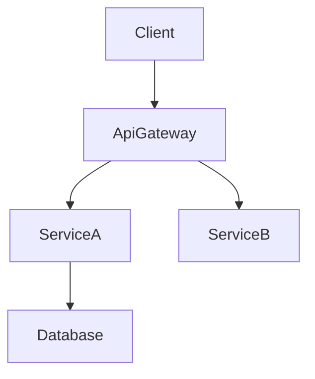

# 技術設計の原則

## 基本原則

### 1. 型安全は必須
- TypeScriptでは `any` 型を絶対に使わない
- 全パラメータと戻り値に明示的な型を定義
- エラーハンドリングには判別共用体を使用
- ジェネリクスの制約を明確に指定
- 静的型付け言語: 明示的な型/インターフェース定義、unsafe キャストを避ける
- 動的型付け言語: 型ヒント/アノテーションを可能な限り使用（例: Python型ヒント）、境界で入力を検証

### 2. 設計 vs 実装
- **WHATに集中し、HOWは書かない**
- インターフェースとコントラクトを定義し、コードは書かない
- 事前条件/事後条件で動作を規定
- アルゴリズムではなくアーキテクチャ上の決定を記述

### 3. ビジュアルコミュニケーション
- **シンプル機能**: 基本的なコンポーネント図、または不要
- **中程度の複雑さ**: アーキテクチャ + データフロー
- **高複雑度**: 複数の図（アーキテクチャ、シーケンス、状態）
- **常にプレーンMermaid**: スタイリングなし、構造のみ

### 4. コンポーネント設計ルール
- **単一責任**: コンポーネントごとに1つの明確な目的
- **明確な境界**: 明示的なドメイン所有権
- **依存方向**: アーキテクチャレイヤーに従う
- **インターフェース分離**: 最小限で焦点を絞ったインターフェース
- **チームセーフなインターフェース**: マージコンフリクトなしに並列実装可能な境界設計
- **リサーチトレーサビリティ**: 境界の決定と根拠を `research.md` に記録

### 5. データモデリング標準
- **ドメインファースト**: ビジネス概念から始める
- **整合性境界**: 明確な集約ルート
- **正規化**: パフォーマンスと整合性のバランス
- **進化**: スキーマ変更を計画

### 6. エラーハンドリング哲学
- **Fail Fast**: 早期に明確に検証
- **グレースフルデグラデーション**: 完全な障害より部分的な機能維持
- **ユーザーコンテキスト**: 実行可能なエラーメッセージ
- **可観測性**: 包括的なロギングとモニタリング

### 7. 統合パターン
- **疎結合**: 依存関係を最小化
- **コントラクトファースト**: 実装前にインターフェースを定義
- **バージョニング**: API進化を計画
- **冪等性**: リトライ安全な設計
- **コントラクト可視性**: APIとイベントコントラクトをdesign.mdに公開、詳細は`research.md`から参照

## ドキュメント標準

### 言語とトーン
- **宣言的**: 「システムはユーザーを認証する」（「すべき」ではなく）
- **正確**: 曖昧な記述より具体的な技術用語
- **簡潔**: 必要不可欠な情報のみ
- **フォーマル**: プロフェッショナルな技術文書

### 構造要件
- **階層的**: 明確なセクション構成
- **トレーサブル**: 要件からコンポーネントへのマッピング
- **完全**: 実装に必要な全側面をカバー
- **一貫性**: 全体を通じて統一された用語
- **焦点**: design.mdはアーキテクチャとコントラクトに集中、調査ログや詳細比較は`research.md`へ

## セクション作成ガイダンス

### 要件ID
- 要件をプレフィックスなしで `2.1, 2.3` として参照（「要件2.1」とは書かない）
- 全要件は数値IDを持つ必須。数値IDがない場合は停止して `requirements.md` を修正
- `N.M` 形式の数値IDを使用

### 技術スタック
- この機能に影響するレイヤーのみ記載
- 各レイヤーでツール/ライブラリ + バージョン + 機能内での役割を指定
- 詳細な根拠や比較は `research.md` へ

### システムフロー
- 非自明なフローを説明するために必要な図のみ提供
- プレーンMermaid構文を使用
- シンプルなCRUD変更では省略可

### 要件トレーサビリティ
- 標準テーブル使用: `要件 | 概要 | コンポーネント | インターフェース | フロー`
- 複雑または準拠性が重要な機能向け

## Mermaidガイドライン

- **プレーンMermaidのみ** — カスタムスタイリングや非サポート構文を避ける
- **ノードID** — 英数字とアンダースコアのみ（`@`, `/`, 先頭の `-` は不可）
- **ラベル** — シンプルな単語。括弧`()`, 角括弧`[]`, クオート`"`, スラッシュ`/`を埋め込まない
- **エッジ** — データまたは制御フローの方向を示す

## 品質チェックリスト
- 全要件が対処済み
- 実装詳細が漏れていない
- 明確なコンポーネント境界
- 明示的なエラーハンドリング
- 包括的なテスト戦略
- セキュリティ考慮済み
- パフォーマンス目標定義済み
- マイグレーションパス明確（該当する場合）
